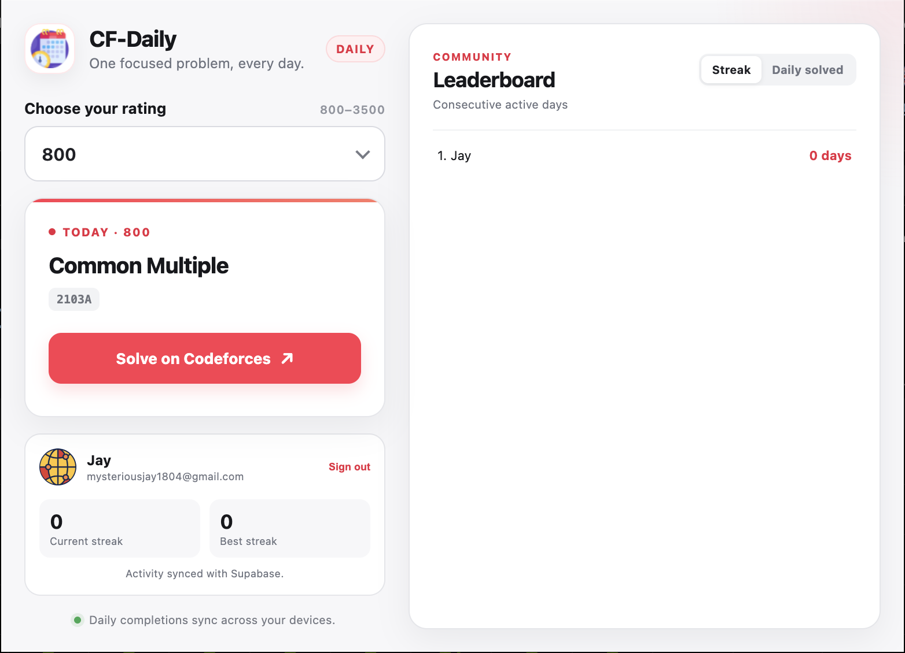
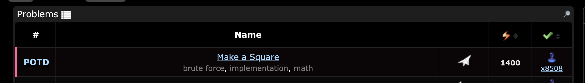

# CF-Daily

CF-Daily is a lightweight browser extension that gives everyone the same Codeforces Problem of the Day for the rating they choose.

Every Codeforces rating from 800 through 3500 has one global daily assignment, shown in the extension popup and at the top of the Codeforces problemset table.

## Features

- Choose an exact Codeforces problem rating from 800 to 3500.
- Receive one globally consistent problem per UTC date and rating.
- Reattempt the POTD even if you accepted it before it became the daily problem.
- Keep the same POTD after solving it instead of generating another problem that day.
- See completed POTDs clearly marked in the popup and problemset table.
- View a 365-day activity heatmap on your Codeforces profile.
- Switch between a combined heatmap and an independent heatmap for every rating.
- Switch ratings without changing or completing assignments for other ratings.
- Keep assignments and preferences locally in browser storage.

## Screenshots

### Rating-specific POTD popup



### Codeforces problemset integration



## How daily assignments work

The first time any rating is selected on a given day, CF-Daily deterministically selects a problem at that exact rating and saves its contest and problem ID using this combination:

```text
UTC date + rating
```

The selection does not depend on the current user or their submission history, so everyone receives the same problem for that UTC date and rating. Every later visit that day uses the saved assignment. A previous acceptance is shown as **Solved before** but does not replace or complete the POTD; accepting it again during its assigned UTC day marks it as completed. Each rating has its own independent assignment.

## Activity heatmaps

Open your own Codeforces profile to see the **CF-Daily Activity** panel. The combined view counts every completed rating-specific POTD for each day, while the selector provides a separate view for every rating from 800 through 3500.

Completion records are currently stored only in `chrome.storage.local`. The profile page backfills missing records by matching locally saved assignments with accepted Codeforces submissions made on the corresponding POTD date.

## Codeforces account detection

CF-Daily does not have a separate sign-in form and never asks for Codeforces credentials. Visit the [Codeforces problemset](https://codeforces.com/problemset) while signed in, and the extension detects the handle from the page. It then uses the public Codeforces API to track same-day accepted submissions for the activity heatmap.

The extension still assigns the same global POTD without a detected handle, but completion tracking requires a Codeforces account.

## Install from source

### Chrome, Edge, or Brave

1. Download or clone this repository.
2. Open the browser's extensions page, such as `chrome://extensions`.
3. Enable **Developer mode**.
4. Select **Load unpacked**.
5. Choose the repository folder containing `manifest.json`.
6. Visit the Codeforces problemset once, then open CF-Daily and choose a rating.

### Firefox

1. Open `about:debugging#/runtime/this-firefox`.
2. Select **Load Temporary Add-on**.
3. Choose `manifest.json` from this repository.

Temporary Firefox add-ons must be loaded again after restarting the browser.

## Development

CF-Daily is a Manifest V3 extension built with plain HTML, CSS, and JavaScript. It does not require a compilation step or production dependencies.

Run the selection and persistence tests with:

```bash
node --test
```

Create a Chrome Web Store ZIP directly from the canonical extension tree:

```bash
zip -r ../CF-Daily-Web-Store-v1.5.0.zip manifest.json src icons LICENSE -x '*.DS_Store'
```

The main extension files are:

- `src/potd.js` — rating normalization, Codeforces API access, completion matching, and deterministic selection.
- `src/popup.js` — popup state, rating selection, persistent assignments, and completion display.
- `src/script.js` — Codeforces account detection and problemset-table integration.
- `src/profile.js` — local completion backfilling and combined/rating-specific profile heatmaps.
